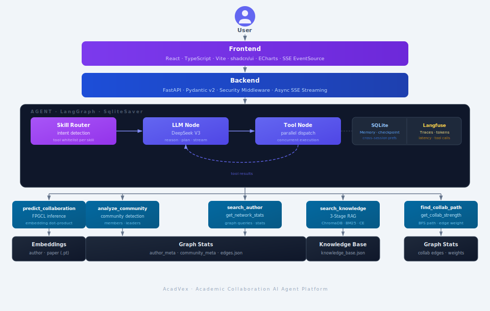

<div align="center">


<h1>AcadVex</h1>

<p><strong>AI Agent Platform for Academic Collaboration Networks</strong></p>

<p>
  <a href="https://python.org"></a>
  <a href="https://fastapi.tiangolo.com"></a>
  <a href="https://react.dev"></a>
  <a href="https://langchain-ai.github.io/langgraph/"></a>
  <a href="LICENSE"></a>
</p>

<p>
  <a href="README_zh.md">中文文档</a> ·
  <a href="#-quick-start">Quick Start</a> ·
  <a href="#-architecture">Architecture</a> ·
  <a href="#-extending">Extending</a> ·
  <a href="DEVELOPMENT_PLAN.md">Dev Plan</a>
</p>

</div>

---

AcadVex wraps a pretrained **FPGCL** graph neural network inside a conversational AI Agent. Describe your research interest in plain language — the agent routes your intent to the right Skill, invokes GNN inference or RAG retrieval, and streams back explainable answers alongside an interactive collaboration graph.

> Model training code lives in the companion **[FPGCL](https://github.com/A-peiron/FPGCL)** repository.

---

## Features

| | Feature | Description |
|---|---|---|
| 🔮 | **Collaboration Prediction** | Score any author pair with the pretrained FPGCL model (HAEGNN-MGPG + IHGCL) |
| 🕸️ | **Community Analysis** | Detect research communities, rank members, surface cross-community bridges |
| 📚 | **3-Stage RAG** | ChromaDB dense → BM25 sparse → CrossEncoder reranker |
| ⚡ | **Streaming** | Token-by-token SSE output, no waiting for the full response |
| 🔭 | **Observability** | Langfuse traces every Agent call — tools, latency, token cost |
| 🛡️ | **Safety** | Prompt injection filter, Pydantic output constraints, per-Skill tool whitelist |
| 🧠 | **Long-term Memory** | SQLite persists user research interests across sessions |
| 🔌 | **Extensible** | Registry-pattern Tools & Skills — add a capability in two steps |

---

## Architecture



---

## Tech Stack

```
LLM            DeepSeek V3 / Qwen-Plus     OpenAI-compatible · accessible in mainland China
Agent          LangGraph                   State graph · Skill router · SqliteSaver checkpoint
Backend        FastAPI + Pydantic v2       Async · auto OpenAPI docs · strict schema validation
Streaming      Server-Sent Events          Token-by-token via StreamingResponse + EventSource
Frontend       TypeScript + React + Vite   shadcn/ui components · ECharts force-directed graph
RAG            ChromaDB + BM25 + CE        3-stage pipeline: dense → sparse → rerank
Observability  Langfuse (self-hosted)      Full trace: tools · latency · token cost
Memory         SQLite                      Cross-session user preference persistence
```

---

## Quick Start

**Prerequisites:** Python 3.10+ · Node.js 18+ · Docker Desktop · DeepSeek or Qwen API key

```bash
# Clone
git clone https://github.com/your-username/AcadVex.git
cd AcadVex

# Python environment
python -m venv venv
source venv/bin/activate        # Windows: venv\Scripts\activate
pip install -r requirements.txt

# Configure
cp .env.example .env            # then fill in your API key

# Start Langfuse  →  open http://localhost:3000
docker-compose up -d

# Prepare pre-computed data  (run export_for_app.py in FPGCL repo first)
# python ../FPGCL/export_for_app.py --dataset dblp --out ./data/

# Start backend  →  http://localhost:8000/docs
python -m api.main

# Start frontend  →  http://localhost:5173
cd frontend && npm install && npm run dev
```

---

## Project Structure

```
AcadVex/
├── agent/
│   ├── tools/
│   │   ├── __init__.py          ← TOOL_REGISTRY
│   │   ├── collab_tools.py      ← FPGCL inference wrapper
│   │   ├── community_tools.py
│   │   ├── author_tools.py
│   │   ├── network_tools.py
│   │   ├── rag_tools.py
│   │   └── _template.py         ← copy to add a new tool
│   ├── skills/
│   │   ├── __init__.py          ← SKILL_REGISTRY
│   │   ├── collab_skill.py
│   │   ├── community_skill.py
│   │   ├── author_skill.py
│   │   └── _template.py         ← copy to add a new Skill
│   ├── loop.py                  ← hand-written ReAct loop (educational)
│   ├── graph.py                 ← LangGraph state graph (production)
│   └── prompts.py
├── api/                         ← FastAPI backend
├── rag/                         ← 3-stage retrieval pipeline
├── memory/                      ← SQLite cross-session memory
├── model/                       ← FPGCL inference wrapper
├── data/                        ← pre-computed data  [git-ignored]
├── frontend/                    ← TypeScript + React + ECharts
├── extensions/
│   └── README.md                ← HITL · MCP Server · cloud deploy · security
├── tests/
│   └── demo_scenarios.py
├── assets/
│   └── logo.svg
├── docker-compose.yml
├── .env.example
└── requirements.txt
```

---

## Extending

**Add a Tool** — two steps, no other files to touch:
```
1.  agent/tools/my_tool.py      (copy _template.py, implement your function)
2.  agent/tools/__init__.py     (add one line to TOOL_REGISTRY)
```

**Add a Skill** — same pattern:
```
1.  agent/skills/my_skill.py    (copy _template.py, set system_prompt + allowed_tools)
2.  agent/skills/__init__.py    (add one line to SKILL_REGISTRY)
```

For larger extensions — HITL interrupts, MCP Server, cloud deployment, advanced security hardening — see [`extensions/README.md`](extensions/README.md).

---

## Security

| Risk | Defense |
|------|---------|
| Prompt Injection | Input keyword filter before reaching LLM · hard system/user prompt separation |
| Prompt Leaking | No secrets in system prompt · Pydantic `extra="forbid"` on all output schemas |
| Tool Abuse | Per-Skill `allowed_tools` whitelist · max tool-call depth enforced in LangGraph |

---

## Related

| Repo | Description |
|------|-------------|
| [FPGCL](https://github.com/your-username/FPGCL) | GNN training — HAEGNN-MGPG encoder + IHGCL contrastive learning on academic graphs |

---

<div align="center">
<sub>MIT License · Built for academic research · PRs welcome</sub>
</div>
