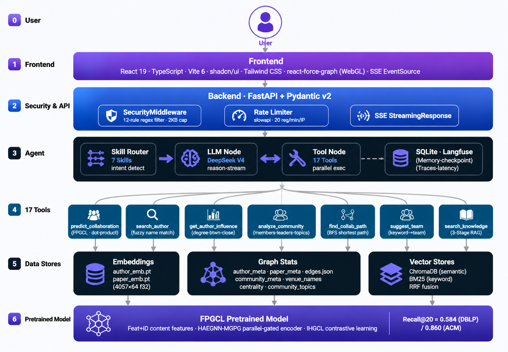

<div align="center">


<h1>AcadVex</h1>

<p><strong>AI Agent Platform for Academic Collaboration Networks</strong></p>

<p>
  <a href="https://python.org"></a>
  <a href="https://fastapi.tiangolo.com"></a>
  <a href="https://react.dev"></a>
  <a href="https://langchain-ai.github.io/langgraph/"></a>
  <a href="LICENSE"></a>
</p>

<p>
  <a href="README_zh.md">中文文档</a> ·
  <a href="#-quick-start">Quick Start</a> ·
  <a href="#-architecture">Architecture</a> ·
  <a href="#-extending">Extending</a>
</p>

</div>

---

AcadVex wraps a pretrained **FPGCL** graph neural network inside a conversational AI Agent. Describe your research interest in plain language — the agent routes your intent to the right Skill, invokes GNN inference or RAG retrieval, and streams back explainable answers alongside an interactive force-directed collaboration graph.

> **FPGCL** = Feat+ID content features + HAEGNN-MGPG parallel-gated encoder + IHGCL contrastive learning.  
> Recall@20: **0.584** (DBLP) / **0.860** (ACM) — **+261%** over IHGCL baseline.  
> Model training code lives in the companion **[FPGCL](https://github.com/A-peiron/FPGCL)** repository.

---

## Features

| | Feature | Description |
|---|---|---|
| 🔮 | **Collaboration Prediction** | Score any author pair with the pretrained FPGCL model (HAEGNN-MGPG + IHGCL) |
| 🕸️ | **Force-Directed Graph** | 4,057 nodes @ 60fps via WebGL; full-graph and 2-hop ego-network modes; drag-to-pin, community coloring |
| 🤖 | **17-Tool AI Agent** | ReAct loop with 7 intent Skills — only the relevant tool subset is exposed per query |
| 📚 | **Hybrid RAG** | ChromaDB semantic search + BM25 keyword matching + RRF fusion for cold-start author discovery |
| ⚡ | **Streaming** | Token-by-token SSE output with real-time tool-call status indicators |
| 🔭 | **Observability** | Langfuse traces every Agent call — tools, latency, token cost |
| 🛡️ | **Safety** | Prompt injection filter (12 regex rules), 2 KB request cap, per-Skill tool whitelist |
| 💬 | **Chat History** | localStorage multi-session persistence — conversations survive page refresh |
| 🔌 | **Extensible** | Registry-pattern Tools & Skills — add a capability in two steps |

---

## Architecture



---

## Tech Stack

```
LLM            DeepSeek V3                 OpenAI-compatible · accessible in mainland China
Agent          LangGraph + hand-written ReAct  State graph · Skill router · SqliteSaver checkpoint
Backend        FastAPI + Pydantic v2       Async · auto OpenAPI docs · strict schema validation
Streaming      Server-Sent Events          Token-by-token via StreamingResponse + EventSource
Frontend       TypeScript + React 19       shadcn/ui + Tailwind CSS · react-force-graph WebGL
RAG            ChromaDB + BM25 + RRF       Hybrid retrieval: semantic + keyword fusion
Observability  Langfuse (self-hosted)      Full trace: tools · latency · token cost
Graph Model    FPGCL (HAEGNN-MGPG+IHGCL)  Pretrained on DBLP/ACM academic collaboration graphs
```

---

## Quick Start

**Prerequisites:** Docker Desktop · DeepSeek API key

### Option A — Docker (recommended)

```bash
git clone https://github.com/A-peiron/AcadVex.git
cd AcadVex

cp .env.example .env            # fill in DEEPSEEK_API_KEY

docker-compose up --build       # backend → :8000  frontend → :8080
```

Open `http://localhost:8080`.

### Option B — Local development

**Additional prerequisites:** Python 3.10+ · Node.js 18+

```bash
git clone https://github.com/A-peiron/AcadVex.git
cd AcadVex

# Backend
python -m venv venv && source venv/bin/activate   # Windows: venv\Scripts\activate
pip install -r requirements.txt
cp .env.example .env            # fill in DEEPSEEK_API_KEY
python -m uvicorn api.main:app --reload            # → http://localhost:8000/docs

# Frontend (new terminal)
cd frontend && npm install && npm run dev          # → http://localhost:5173
```

> **Data files:** Run `export_for_app.py` in the [FPGCL](https://github.com/A-peiron/FPGCL) repo first to generate `data/embeddings/` and `data/graph_stats/`, then run `python scripts/build_author_vectordb.py`.

---

## Project Structure

```
AcadVex/
├── agent/
│   ├── tools/
│   │   ├── __init__.py          ← TOOL_REGISTRY (17 tools)
│   │   ├── collab_tools.py      ← predict_collaboration · search_author · network_stats
│   │   ├── author_tools.py      ← 6 personal analysis tools
│   │   ├── community_tools.py   ← 3 community analysis tools
│   │   ├── network_tools.py     ← find_collab_path · suggest_team · overview
│   │   └── rag_tools.py         ← search_knowledge (ChromaDB + BM25)
│   ├── skills/
│   │   ├── __init__.py          ← SKILL_REGISTRY (7 skills)
│   │   ├── collab.py            ← triggers: collaboration · prediction
│   │   ├── community.py         ← triggers: community · research area
│   │   ├── author_analysis.py   ← triggers: influence · rising stars · compare
│   │   ├── team_formation.py    ← triggers: team · path · six degrees
│   │   ├── research_landscape.py← triggers: overview · global · trends
│   │   ├── collab_search.py     ← triggers: find scholar · search
│   │   └── general.py           ← fallback
│   ├── loop.py                  ← hand-written ReAct loop (streaming SSE + Langfuse)
│   ├── graph.py                 ← LangGraph state graph (Skill router + SqliteSaver)
│   └── prompts.py
├── api/
│   ├── main.py                  ← FastAPI app · lifespan · CORS · SecurityMiddleware
│   ├── schemas.py               ← Pydantic models
│   ├── middleware/
│   │   ├── security.py          ← prompt injection filter (12 rules, 2 KB cap)
│   │   └── rate_limit.py        ← slowapi rate limiter (20 req/min per IP)
│   └── routes/
│       ├── chat.py              ← POST /api/chat/stream (SSE)
│       ├── authors.py           ← search · detail · recommendations · papers · influence
│       ├── graph.py             ← full graph · ego-network
│       └── recommendations.py  ← POST /api/recommendations/by-keywords
├── frontend/src/
│   ├── App.tsx                  ← dual-tab layout (Network Explorer + AI Chat)
│   ├── components/
│   │   ├── ForceGraphVisualization.tsx  ← WebGL force graph (4,057 nodes @ 60fps)
│   │   ├── ChatPanel.tsx        ← SSE streaming chat with ReactMarkdown
│   │   ├── ChatHistorySidebar.tsx       ← localStorage multi-session sidebar
│   │   ├── AuthorCard / AuthorSearch / CollabRecommendations
│   │   ├── PaperList / AuthorInfluence
│   │   └── ErrorBoundary.tsx
│   └── hooks/
│       ├── useSSE.ts            ← SSE streaming + tool-call event parsing
│       └── useChatHistory.ts    ← localStorage multi-session persistence
├── model/inference.py           ← FPGCL dot-product scoring
├── rag/
│   ├── retriever.py             ← 3-stage hybrid retrieval (ChromaDB + BM25 + CrossEncoder)
│   └── build_index.py
├── memory/store.py              ← SqliteSaver long-term chat memory
├── data/                        ← see data/README.md
├── scripts/                     ← precompute centrality, topics, vector stores
├── tests/                       ← pytest unit + integration + e2e tests
├── Dockerfile                   ← backend image
├── frontend/Dockerfile          ← frontend multi-stage build (nginx)
├── docker-compose.yml
├── .env.example
└── requirements.txt
```

---

## API Reference

| Method | Path | Description |
|--------|------|-------------|
| POST | `/api/chat/stream` | SSE streaming AI conversation |
| GET | `/api/authors/search?q=Wei` | Fuzzy name search |
| GET | `/api/authors/{id}` | Author detail |
| GET | `/api/authors/{id}/recommendations` | FPGCL top-K collaborator recommendations |
| GET | `/api/authors/{id}/papers?page=&page_size=` | Paginated paper list |
| GET | `/api/authors/{id}/influence` | Degree / betweenness / closeness centrality |
| GET | `/api/graph/full` | Full graph (4,057 nodes + edges) |
| GET | `/api/graph/ego?author_id=X&hops=2` | N-hop ego-network |
| POST | `/api/recommendations/by-keywords` | Cold-start hybrid retrieval by research keywords |

---

## Extending

**Add a Tool** — two steps, no other files to touch:
```
1.  agent/tools/my_tool.py      (copy _template.py, implement your function)
2.  agent/tools/__init__.py     (add one line to TOOL_REGISTRY)
```

**Add a Skill** — same pattern:
```
1.  agent/skills/my_skill.py    (copy _template.py, set system_prompt + allowed_tools)
2.  agent/skills/__init__.py    (add one line to SKILL_REGISTRY)
```

For larger extensions — HITL interrupts, MCP Server, cloud deployment, advanced security hardening — see [`extensions/README.md`](extensions/README.md).

---

## Security

| Risk | Defense |
|------|---------|
| Prompt Injection | 12-rule regex filter before reaching LLM · hard system/user prompt separation |
| Request Abuse | 2 KB body cap on `/api/chat` · per-Skill `allowed_tools` whitelist |
| Tool Abuse | Max 10 ReAct iterations · tool errors return structured JSON, never crash the loop |

---

## Roadmap

- [x] Structured logging (structlog) · retry with exponential backoff (tenacity) · rate limiting (slowapi) · `/health` endpoint
- [x] Tool-call status indicator in chat UI · stop-generation button · message copy · error Toast with retry
- [x] Docker + docker-compose · unit tests (pytest) · `.env.example`
- [ ] Demo video · defense presentation script

---

## Related

| Repo | Description |
|------|-------------|
| [FPGCL](https://github.com/A-peiron/FPGCL) | GNN training — HAEGNN-MGPG encoder + IHGCL contrastive learning on academic graphs |

---

<div align="center">
<sub>Apache 2.0 License · Built for academic research · PRs welcome</sub>
</div>
